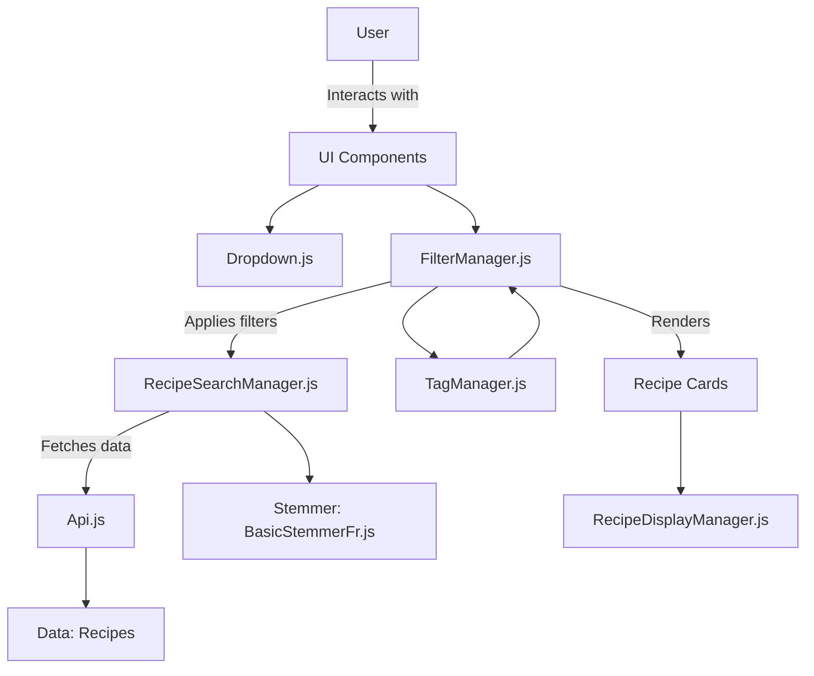

Here's the markdown version of your updated **README.md** file:

```markdown
# Les Petits Plats - Recipe Search Application


## Overview

**Les Petits Plats** is a web-based recipe search application designed to help users browse a large database of daily recipes. With over 1500 recipes available, users can search by recipe names, ingredients, appliances, or utensils and easily filter the results using advanced search functionalities. The interface is responsive, ensuring seamless usage across devices, and the real-time search provides a fast and efficient user experience.

## Features

- **Real-time Search**: Instantly search by recipe names, ingredients, or appliances with dynamic filtering.
- **Advanced Filtering**: Filter recipes using selected tags (ingredients, appliances, utensils) to refine your search.
- **Responsive Design**: Built to work perfectly on desktops, tablets, and mobile devices.
- **Clear Search**: Easily reset your search using the clear button for an uninterrupted experience.
- **Stemming Implementation**: Both singular and plural word forms are matched, e.g., searching for "banane" also retrieves "bananes."

## Tech Stack

- **HTML5**: For structuring content.
- **Tailwind CSS**: A utility-first CSS framework used for styling the UI.
- **JavaScript (ES6)**: Handles client-side logic and dynamic content rendering.
- **Sass**: Used for styling efficiency and maintainability.
- **Google Fonts**: Custom fonts (`Anton` and `Manrope`) are used for a modern aesthetic.

## Project Structure

```bash
js/
 ┣ api/
 ┃ ┗ Api.js                # Handles recipe data interactions, including normalization and filtering
 ┣ components/
 ┃ ┣ Dropdown.js           # Manages dropdown filters (ingredients, appliances, utensils)
 ┃ ┣ FilterManager.js      # Central manager for handling filters and the search term
 ┃ ┣ RecipeSearchManager.js # Handles recipe search with word stemming
 ┃ ┣ SearchBarController.js # Manages search bar input and UI behavior
 ┃ ┗ TagManager.js         # Manages tags and dynamic filtering behavior
 ┣ data/
 ┃ ┗ recipes.js            # Recipe data (over 1500 items)
 ┣ layout/
 ┃ ┗ RecipeCard.js         # Responsible for rendering individual recipe cards
 ┣ utils/
 ┃ ┗ BasicStemmerFr.js     # Custom French stemmer for word normalization
 ┃ ┗ RecipeDisplayManager.js # Manages filtered recipe display and results count
 ┗ main.js                 # Entry point, initializes the application
```

## Application Architecture

The application consists of several key components, each responsible for managing different aspects of the recipe search functionality. The interaction between the components is illustrated in the diagram below.



### Explanation:

1. **UI Components**: The user interacts with dropdowns and tags for filtering.
2. **FilterManager.js**: Centralized manager that applies filters, updates search terms, and renders recipes based on selected tags and search input.
3. **RecipeSearchManager.js**: Handles the core search logic, including stemming to match both singular and plural forms.
4. **Api.js**: Retrieves and filters recipe data from the dataset based on user input.
5. **BasicStemmerFr.js**: Custom French stemmer that normalizes search terms, ensuring flexible search functionality.
6. **TagManager.js**: Manages the addition/removal of active filters/tags.
7. **RecipeDisplayManager.js**: Responsible for rendering the filtered recipes and updating the recipe count.

---

## Class Breakdown

### **1. Api.js**
**Class Api** manages recipe data interactions, including normalization of search terms (via the `BasicStemmerFr`) and filtering recipes based on ingredients, appliances, or utensils.

### **2. FilterManager.js**
**Class FilterManager** centralizes the management of active filters (tags), dynamically applying them to the search results and rendering the corresponding recipes.

### **3. TagManager.js**
**Class TagManager** handles adding and removing tags (for ingredients, appliances, and utensils) and dynamically updating the filter results accordingly.

### **4. RecipeSearchManager.js**
**Class RecipeSearchManager** processes user search queries and matches them against the recipe dataset using a custom French stemmer for both singular and plural forms.

### **5. SearchBarController.js**
**Class SearchBarController** handles user input within the search bar, manages the display of the clear button, and coordinates between the filter manager and recipe rendering.

### **6. BasicStemmerFr.js**
**Class BasicStemmerFr** is a custom French word stemmer that normalizes words (like "banane" and "bananes") to ensure more flexible search results.

### **7. RecipeDisplayManager.js**
**Class RecipeDisplayManager** manages the display of filtered recipes and ensures that the recipe count is updated dynamically based on search results.

---

## How It Works

1. Users select filters from dropdowns (ingredients, appliances, utensils) or enter a search term in the search bar.
2. **FilterManager.js** applies the selected filters and forwards them to the **RecipeSearchManager.js**.
3. The **RecipeSearchManager.js** processes the input, normalizes the words using the **BasicStemmerFr.js**, and matches them against the recipe data fetched by **Api.js**.
4. Recipes that match the filters are dynamically rendered using **RecipeCard.js**, while the **RecipeDisplayManager.js** ensures that the recipe count is updated correctly.

---

## Installation and Setup

1. Clone the repository:
   ```bash
   git clone https://github.com/yourusername/les-petits-plats.git
   ```
2. Navigate to the project directory:
   ```bash
   cd les-petits-plats
   ```
3. Install necessary dependencies:
   ```bash
   npm install
   ```
4. Run the application on a local development server:
   ```bash
   npm run dev
   ```

---

## License

This project is licensed under the MIT License.
```

You can now use this **README.md** in your project.